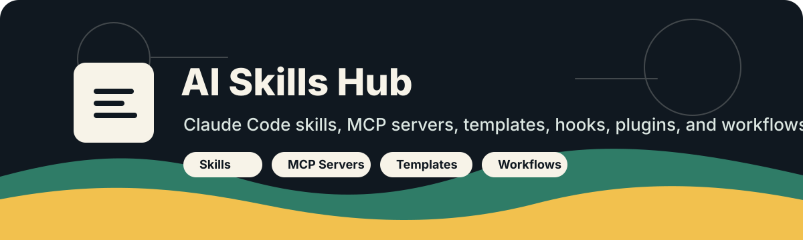

<p align="center">
  
</p>

<h1 align="center">AI Skills Hub</h1>

<p align="center">
  A curated directory of Claude Code skills, MCP servers, and <code>CLAUDE.md</code> templates.
  <br />
  Every catalog page notes when its links were last verified. Broken local links fail CI.
</p>

<p align="center">
  <a href="docs/skills-vs-mcp-vs-commands-vs-hooks.md"><strong>New: Skills vs MCP vs Commands vs Hooks →</strong></a>
</p>

<p align="center">
  <a href="skills/README.md">Skills</a> ·
  <a href="mcp-servers/README.md">MCP Servers</a> ·
  <a href="routines/README.md">Routines</a> ·
  <a href="templates/README.md">Templates</a> ·
  <a href="cheatsheet/README.md">Cheatsheet</a> ·
  <a href="CONTRIBUTING.md">Contribute</a>
</p>

<p align="center">
  <a href="https://github.com/Omrigotlieb/ai-skills/actions/workflows/docs-checks.yml"></a>
  <a href="CONTRIBUTING.md"></a>
  <a href="LICENSE"></a>
  <a href="https://github.com/Omrigotlieb/ai-skills/stargazers"></a>
</p>

> Links last verified: 2026-04-22

## Pick Your Path

| If you want to... | Start here |
|---|---|
| Understand when to use skills vs MCP vs hooks | [Comparison](docs/skills-vs-mcp-vs-commands-vs-hooks.md) |
| Set up Claude Code on a new project | [CLAUDE.md templates](templates/README.md) |
| Find useful skills by category | [Skills catalog](skills/README.md) |
| Add external tools and integrations | [MCP server guides](mcp-servers/README.md) |
| Automate recurring work with scheduled agents | [Routines & scheduled tasks](routines/README.md) |
| Improve day-to-day workflow | [Tips](tips/README.md) and [Workflows](workflows/README.md) |
| Learn commands and shortcuts fast | [Cheatsheet](cheatsheet/README.md) |
| Understand automation hooks | [Hooks guide](hooks/README.md) |

## What You Get

| Area | What's there |
|---|---|
| [Skills](skills/README.md) | Curated index of Claude Code skills with descriptions and triggers |
| [MCP Servers](mcp-servers/README.md) | Comparison of tools and integrations to cut guessing time |
| [Routines](routines/README.md) | Ready-to-use prompt templates for scheduled agents and cloud routines |
| [Templates](templates/README.md) | Copy-ready `CLAUDE.md` scaffolds for common stacks and project types |
| [Cheatsheet](cheatsheet/README.md) | Commands, shortcuts, config, and prompt reference |
| [Tips](tips/README.md) | Practical habits and setup wins that improve daily usage |
| [Hooks](hooks/README.md) | Lifecycle automation and safety patterns |
| [Workflows](workflows/README.md) | Repeatable patterns for planning, shipping, debugging, and review |
| [Prompts](prompts/README.md) | Reusable prompt structures for common engineering tasks |

## Contributing

Contributions are most useful when they add verified resources, clearer descriptions, or better examples.

- Submit a new resource: [open a submission issue](https://github.com/Omrigotlieb/ai-skills/issues/new?template=new-skill.md)
- Report a broken link or outdated doc: [open a fix issue](https://github.com/Omrigotlieb/ai-skills/issues/new?template=bug.md)
- Improve a page directly: [read the contribution guide](CONTRIBUTING.md)

Before opening a PR, run:

```bash
python3 scripts/validate_docs.py
```

## License

MIT. See [LICENSE](LICENSE).
